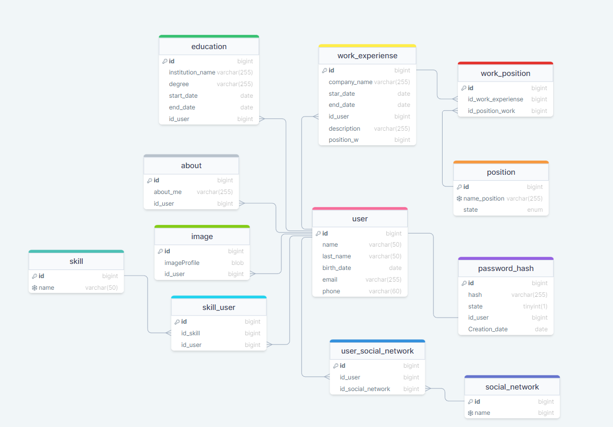

## 🏷️ IN STAGE OF DEVELOPMENT

## **Free portfolio**

Free portfolio is an application created to generate resumes in an easy and intuitive way without resorting to many tools. 

### Features

- Generate resumes quickly
- Intuitive user interface
- Customizable templates
- Export resumes in various formats (PDF, Word, etc.)
- Easy to use and navigate

### Database 

**This is the database you are working on.
This is the database we are working on, which is already in production.**

### Contributing

Contributions are welcome! Here's how you can contribute to Free portfolio:

1. Fork the repository
2. Create a new branch: `git checkout -b feature/your-feature-name`
3. Make your changes and commit them: `git commit -m 'Add some feature'`
4. Push your changes to the branch: `git push origin feature/your-feature-name`
5. Submit a pull request

### Contact

If you have any questions or suggestions, feel free to reach out to us at [juanguiza65@gmail.com](juanguiza65@gmail.com).